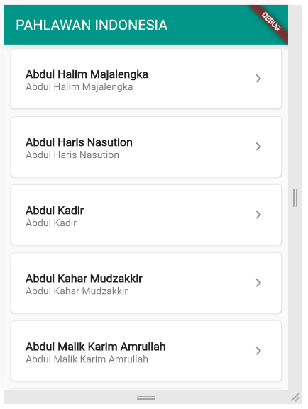
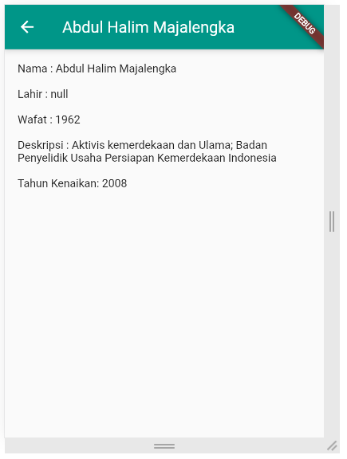

# UAS PEMROGRAMAN MOBILE

**Nama    : Aning Kinanti**  
**NIM     : 312010364**  
**Kelas   : TI.20.A2**  
**Matkul  : Pemrograman Mobile**  

## Membuat Tampilan dari Api Pahlawan Indonesia Menggunakan Framework Flutter

### Output Program Halaman Awal
  

### Output Program Halaman Detail List
  